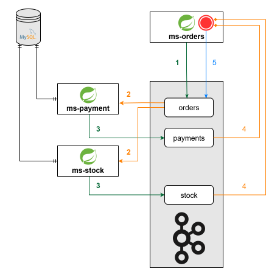

<div align="center">

# Kafka Streams Microservices Demo


**An E-commerce Microservices Application that demonstrates the usage of Kafka Streams.**

</div>

---

## Overview



### Business Logic Flow

1. Client creates Order → POST `/orders`.
2. Order published → orders Kafka topic.
3. Payment Service → Listens, reserves funds → publishes to payments topic.
4. Stock Service → Listens, reserves inventory → publishes to stock topic.
5. Orders Service → Joins both responses → publishes to orders topic.
6. Results → Stored in KTable for querying.
7. Client retrieves order + its status → GET `/orders`.

### 1. (ms-orders) - Order Orchestrator

- RESTful Web Service for order management.
- Orchestrates the order processing flow.
- Publishes orders to Kafka.
- Joins responses from <code>ms-payment</code> and <code>ms-stock</code> services.
- Uses Kafka Streams with KTable for state persistence.
- **Port**: 9091.

### 2. (ms-payment) - Payment Processing Service

- Listens to order events.
- Reserves customer funds.
- Validates payment availability.
- Sends payment decisions back to orders topic.
- Maintains customer account state.
- **Database**: MySQL (customers table).

### 3. (ms-stock) - Inventory Management Service

- Listens to order events.
- Reserves product inventory.
- Validates stock availability.
- Sends stock decisions back to orders topic.
- Maintains product inventory state.
- **Database**: MySQL (products table).
---

## Why Kafka Streams?

### The Business Logic Problem

Look at the Business Logic Flow (steps 3-6):

```
3. Payment Service → publishes PAYMENT decision to payments topic.
4. Stock Service → publishes STOCK decision to stock topic.
5. Orders Service → Joins BOTH responses → publishes FINAL order.
6. Results → Stored in KTable for querying.
```

**The Challenge**:

- Payment service responds to order #123 → publishes to `payments` topic.
- Stock service responds to order #123 (might be delayed) → publishes to `stock` topic.
- **Orders service MUST wait for BOTH and join them based on order ID**.
- **Must handle timing**: What if stock response arrives after payment? Or never arrives?.
- **Must persist**: Final order result queried later in step 7.

> Without a framework, this becomes incredibly complex.

### What Kafka Streams Does For You (Per Business Flow)

| Business Step | Challenge                                      | Without KS                           | With KS                                  |
|---------------|------------------------------------------------|--------------------------------------|------------------------------------------|
| **Step 3-4**  | Consume payment & stock concurrently in orders | Manual threading + offset management | Automatic consumer groups + No listeners |
| **Step 5a**   | Buffer both responses                          | Manual in-memory maps                | Built-in state stores                    |
| **Step 5b**   | Join by order ID within 10 seconds             | Complex correlation logic            | `join()` with time windows               |
| **Step 5c**   | Handle late/missing responses                  | Manual timeout logic                 | Automatic window expiration              |
| **Step 6a**   | Persist final orders                           | Manual database inserts              | Automatic KTable store                   |
| **Step 6b**   | Recovery after crash                           | Manual changelog implementation      | Automatic changelog topics               |
| **Step 7**    | Query persisted orders                         | Manual database queries              | Query KTable directly                    |

### Added Advantages of Kafka Streams

| Feature               | Without Kafka Streams                  | With Kafka Streams                      |
|-----------------------|----------------------------------------|-----------------------------------------|
| **Join Logic**        | 200+ lines of buffer management        | 3 lines with `.join()`                  |
| **Time Windows**      | Manual timestamp tracking & expiration | Automatic window management             |
| **State Persistence** | Build your own changelog system        | Automatic changelog topics              |
| **Exactly-Once**      | Complex distributed transaction logic  | Guaranteed by framework                 |
| **Scaling**           | Manual partitioning coordination       | Automatic dynamic scaling               |
| **Failure Recovery**  | Rebuild state from scratch             | Replay from changelog topic             |
| **Production Ready**  | Months of testing & hardening          | Battle-tested in thousands of companies |

### Key Kafka Streams Features in This Project

1. **Stream Joins** (Step 5): Automatically matches payment + stock responses by order ID with 10-second window.
2. **KTable State Store** (Step 6): Persists final orders in persistent state for querying.
3. **Changelog Topics** (Step 6 Recovery): Auto-created internal topics track all state changes for crash recovery.
4. **Exactly-Once Semantics**: Guarantees no duplicate order processing even if services crash.
5. **Automatic Partitioning**: Scales horizontally - add more instances without code changes.

---

## Testing

```bash
# Start Docker containers
docker-compose up -d

# Verify containers are running
docker ps --filter "name=ecommerce"

# Check network
docker network ls
docker network inspect ecommerce_default

# Verify ports
docker port ecommerce-mysql
docker port ecommerce-kafka-1
docker port ecommerce-kafka-2

# Create a new order
curl -X POST http://localhost:9091/orders \
  -H "Content-Type: application/json" \
  -d '{
    "customerId": 1,
    "productId": 1,
    "productCount": 2,
    "price": 100,
    "status": "NEW"
  }'

# Get all orders
curl http://localhost:9091/orders
```

---

## Notes:

### Internal Kafka Topics

When running Kafka Streams, you may notice additional topics created automatically:

- `ms-orders-streams-app-KSTREAM-JOINTHIS-*-store-changelog` - Internal changelog for join state (left stream)
- `ms-orders-streams-app-KSTREAM-JOINOTHER-*-store-changelog` - Internal changelog for join state (right stream)
- `ms-orders-streams-app-*-changelog` - Internal changelog for KTable state stores

**Why?** Kafka Streams automatically creates these internal topics for:

- **State Management**: Buffering and matching records during stream joins.
- **Fault Tolerance**: Recording state changes for exactly-once semantics.
- **Recovery**: Restoring application state after failures or restarts.

These are required for Kafka Streams to function properly and cannot be disabled. This is expected and normal behavior.

### Serialization & Deserialization

#### The Challenge

In a microservices architecture using Kafka, every service needs to:
- **Produce**: Convert domain objects (Order) → JSON bytes for Kafka.
- **Consume**: Convert JSON bytes from Kafka → domain objects (Order).

Without a centralized approach, each service would implement its own serialization logic, leading to:
- ☠️ Code duplication.
- ☠️ Inconsistency.
- ☠️ Require high maintenance.
- ☠️ Higher risk of bugs and incompatibilities.

#### Solution: Centralized Serialization in Commons Module

We determine the key domain object that all services share: `Order`. This object is produced by ms-orders and consumed by ms-payment and ms-stock.  
Then, we created reusable JSON serializer/deserializer classes in the **commons module** that all services share:

```
commons/
└── utils/
    ├── OrderJsonSerializer.java      
    ├── OrderJsonDeserializer.java    
    └── OrderJsonSerde.java           
```

#### How Each Microservice Uses These Serializers

**ms-stock & ms-payment**
```yaml
# application.yml
spring.kafka:
  consumer:
    value-deserializer: com.tribune.demo.ecommerce.utils.OrderJsonDeserializer
  producer:
    value-serializer: com.tribune.demo.ecommerce.utils.OrderJsonSerializer
```
**ms-orders**
```yaml
# application.yml
spring.kafka:
  producer:
    key-serializer: org.apache.kafka.common.serialization.LongSerializer
    value-serializer: com.tribune.demo.ecommerce.utils.OrderJsonSerializer
```
```java
@KafkaListener(topics = Topics.ORDERS)
public void onEvent(Order order) {  // Auto-deserialized from JSON
    // Process order
}
```

**ms-orders** (Kafka Streams)
```yaml
# application.yml
spring.kafka.streams.properties:
  default.value.serde: com.tribune.demo.ecommerce.utils.OrderJsonSerde
```

```java
@Bean
public KStream<Long, Order> stream(StreamsBuilder builder) {
    Serde<Order> valueSerde = new OrderJsonSerde();
    
    KStream<Long, Order> paymentStream = 
        builder.stream(Topics.PAYMENTS, Consumed.with(keySerde, valueSerde));
}
```

---

## Authors

[](https://linkedin.com/in/zatribune)

**Made with ❤️ for the Java & Spring community**.
